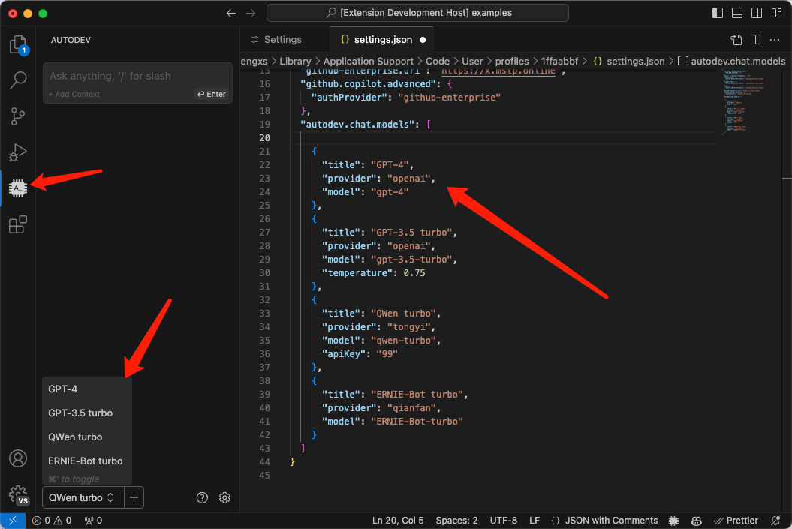

# Configuration

## General

### Enable Rename Suggestion

Enable rename suggestion

### Custom Prompt Dir

Custom prompt directory

## Chat

### Enable

Enable or disable ai chats

### Provider

Choose a default chat model provider to give code interpretation, documentation generation.

### Model

Model for overwrite provider in the provider chat model

### Chat Models

Shows in chat panel model selection list.



- **title** Display selected text
  - **type** `string`
- **provider** Use that LLM Provider.
  - **type** `"anthropic" | "openai" | "qianfan" | "tongyi" | "zhipuai"`
- **baseURL** LLM API baseURL, Default use provider config.
  - **type** `string | undefined`
- **apiKey** LLM API key, Default use provider config.
  - **type** `string | undefined`
- **secretKey** Only Baidu QianFan provider
  - **type** `string | undefined`
- **model** Model name
  - **type** `string`
- **multimodel** Is it multi-model
  - **type** `boolean`
- **temperature** Amount of randomness injected into the response. Ranges from 0 to 1.
  - **type** `number | undefined`
- **maxTokens** A maximum number of tokens to generate before stopping.
  - **type** `number | undefined`
- **stop** A list of strings to use as stop words.
  - **type** `string[] | undefined`
- **clientOptions** Optional parameters
  - **type** `object | undefined`

examples:

```jsonc
[
	{
		"title": "GPT-4",
		"provider": "openai",
		"model": "gpt-4",
	},
	{
		"title": "GPT-3.5 turbo",
		"provider": "openai",
		"model": "gpt-3.5-turbo",
		"temperature": 0.75,
	},
	{
		"title": "QWen turbo",
		"provider": "tongyi",
		"model": "qwen-turbo",
	},
	{
		"title": "ERNIE-Bot turbo",
		"provider": "qianfan",
		"model": "ERNIE-Bot-turbo",
	},
	{
		"title": "ChatGLM 4",
		"provider": "zhipuai",
		"model": "glm-4",
	},
]
```

If there is no configuration of apikey, default get from basic config.

## Code Completions

### Enable

Enable or disable inline completions.

Then, when the editor is triggered (e.g., a carriage return or a line feed or a content change, etc.), it automatically completes your code.

### Provider

Choose a default model provider to give code generation.

### Model

Model for overwrite provider in the provider completion model

### FIM Special Tokens

Fill-in-the-middle (FIM) is a special prompt format supported by the code completion model can complete code between two already written code blocks.

See [Code Completions](./features/code-completion.md).

```json
{
	"autodev.completions.fimSpecialTokens": {
		"prefix": "<PRE>",
		"suffix": "<SUF>",
		"middle": "<MID>"
	}
}
```

### Parameters

Some model parameters.

> Please don't modify it unless you know what you're doing.

```json
{
	"autodev.completions.parameters": {
		"temperature": 0,
		"top_p": 0.9,
		"max_tokens": 500
	}
}
```

### Stops

Up to 4 sequences where the API will stop generating further tokens. The returned text will not contain the stop sequence.

### Request Delay

Code auto-completion delay request time. Avoid excessive consumption of API tokens. `requestDelay` only works if `Autodev: Enable Code Completions` is enabled.

### Enable Legacy Mode

Use legacy `/v1/completion` instead of `/v1/chat/completion`. Only working `openai` provider.

> Will be deprecated when infill is universally supported or openai stop "/v1/completions" support.

### Template

Customize your modeling cue template.

> Place use [FIM Special Tokens](#fim-special-tokens) instead.

Available Variables:

- `prefix` Code before the cursor.
- `suffix` Code after the cursor.
- `language` Current editing file language, for example: "javascript".

The recommended format is FIM ( filling in the middle ), for example:

```sh
<fim_prefix>{prefix}<fim_suffix>{suffix}<fim_middle>

# or

<PRE>{prefix}<SUF>{suffix}<MID>
```

Variables use string replacement, please fill in strictly according to instructions.

## Embeddings

### Provider

Choose a default embedding model provider to give codebase.

### Model

Model for overwrite provider in the provider embedding model.

### BatchSize

Maximum number of batch documents.

## Model Providers

This is the default configuration and can be overridden in different functional areas.

### Anthropic

See [Developer doc](https://docs.anthropic.com/en/docs/intro-to-claude)

- **Base URL** Anthropic API URL, See [API Reference](https://docs.anthropic.com/en/api/getting-started)
- **API Key** Anthropic API key.
- **Model** Chat model used

### OpenAI

See [open.com](https://platform.openai.com/docs/introduction)

- **API Type** OpenAI Official or Microsoft azure servers.
- **Base URL** OpenAI API URL.
- **API Key** Our legacy keys. Provides access to all organizations and all projects that user has been added to; access [API Keys](https://platform.openai.com/account/api-keys) to view your available keys. We highly advise transitioning to project keys for best security practices, although access via this method is currently still supported.
- **Model** Chat model used, See [Model endpoint compatibility](https://platform.openai.com/docs/models/model-endpoint-compatibility)
- **Project** Provides access to a single project (preferred option); Access [Project API Keys](https://platform.openai.com/settings/organization/general) by selecting the specific project you wish to generate keys against.
- **Organization** For users who belong to multiple organizations or are accessing their projects through their legacy user API key, you can pass a header to specify which organization and project is used for an API request. Usage from these API requests will count as usage for the specified organization and project.

### Baidu Cloud WenXin

Baidu Cloud API Key Or Secret Key, See [Create an application](https://console.bce.baidu.com/qianfan/ais/console/applicationConsole/application).

- **API Key** Baidu Cloud API Key
- **Secret Key** Baidu Cloud Secret Key
- **Model** Chat model used

### Ali Cloud TongYi

See [开通 DashScope 并创建 API-KEY](https://help.aliyun.com/zh/dashscope/developer-reference/activate-dashscope-and-create-an-api-key).

- **API Key** Baidu Cloud API Key
- **Model** Chat model used
- **EnableSearch** 启用互联网搜索，模型会将搜索结果作为文本生成过程中的参考信息，但模型会基于其内部逻辑判断是否使用互联网搜索结果。默认：关闭。

### Ollama

See [ollama](https://ollama.com/)

### ZhipuAI

See [智谱 AI 开放平台](https://open.bigmodel.cn/dev/api).

- **API Key** ZhipuAI API Key
- **Model** Chat model used
- **EnableSearch** 启用互联网搜索，模型会将搜索结果作为文本生成过程中的参考信息，但模型会基于其内部逻辑判断是否使用互联网搜索结果。默认：关闭。

### Transformers

local model runtime. For codebase and embedding only.
