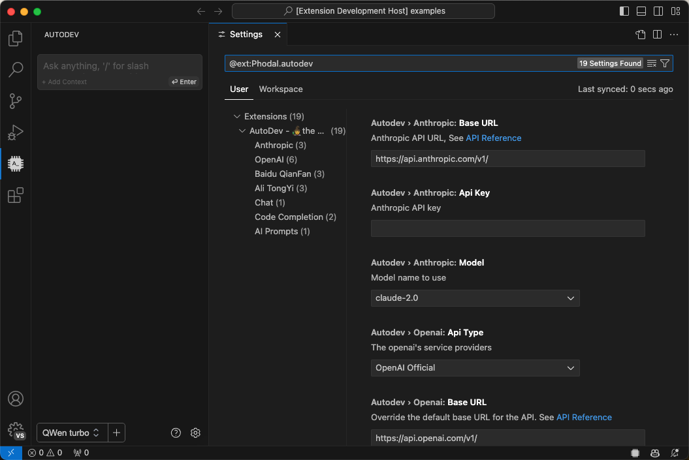

# Quick Start



In the vscode configuration, search for `autodev`, or click the ⚙️ button in the lower right footer of the dialog panel

在当前的设计里，由于精力不足，在 UI 设计上我们基于 Continue 的设计，因此会出现一些不符合直觉的地方，我们会在后续的版本中逐渐优化。诸如于：
**Chat UI 和代码中的 LLM 模型需要分开配置。

> [!IMPORTANT]
> You must configure at least one big model for the plugin to work, see [Configuration](./configuration.md) for details.

## Usage

Config OpenAI example:

1. open `settings.json` in vscode
2. add the following configuration

```
  "autodev.openaiCompatibleConfig": {
    "apiType": "openai",
    "model": "moonshot-v1-8k",
    "apiBase": "https://api.moonshot.cn/v1",
    "apiKey": "xxx"
  },
  "autodev.completion.model": "openai",
```

## Next

- [Enable Code-completion](./features/code-completion.md)